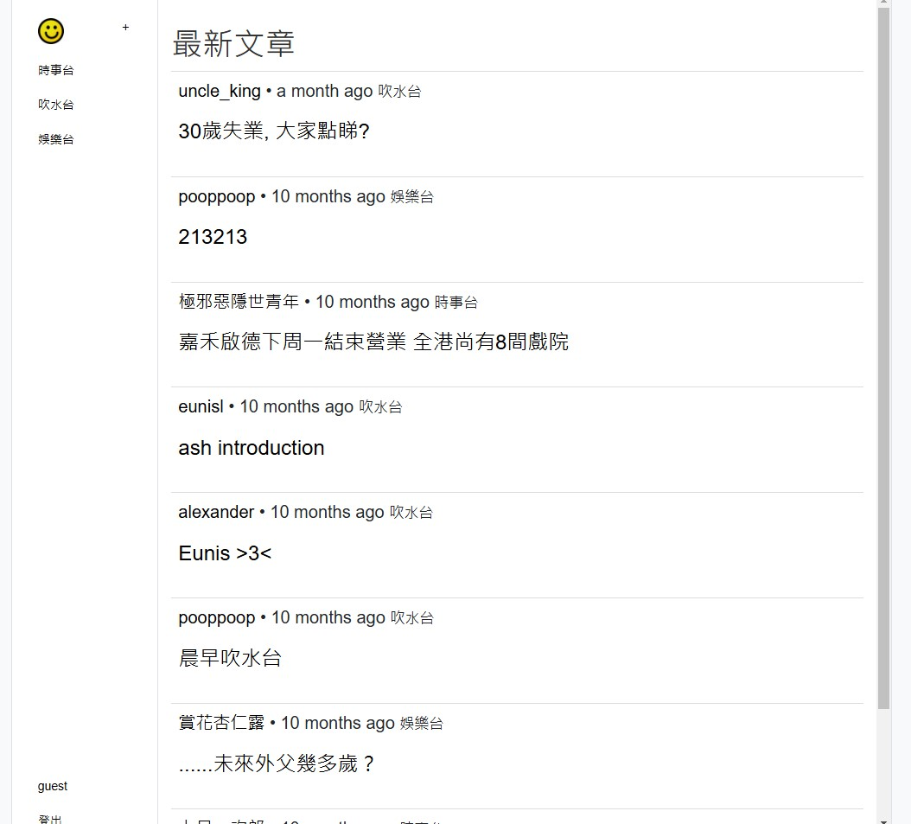

## **Introduction**
During my second semester in the **Cloud Web Application Development** course, I worked on a solo project to **re-implement a database-driven web application** using **HTML, CSS, JavaScript, and Python**. The goal was to choose an existing website concept and rewrite it in **Flask**, integrating modern web technologies and best practices.

For my project, I chose to build a **forum-style website**, inspired by LIHKG, where users can register, create posts, comment, and interact with each other. This was an exciting challenge that involved **full-stack web development**, database integration, and security implementation.

---

## **Objectives**
The project had the following key objectives:
1. **Reimplement a database-driven website** using Python (Flask).
2. **Redesign the UI** using **Bootstrap** to enhance responsiveness and usability.
3. **Implement user authentication**, including login, registration, and session management.
4. **Validate all input fields** to prevent invalid or malicious user input.
5. **Integrate a relational database** (PostgreSQL) to store user accounts, posts, and comments.
6. **Create an admin panel** to allow administrators to manage posts and comments efficiently.

---

## **Project Features**
### 🔹 **User Authentication**
- Users can register, log in, and log out securely.
- Passwords are **hashed** using **Werkzeug** for security.
- A "Forgot Password" feature allows users to reset their credentials.

---

### 🔹 **Posting and Commenting System**
- Registered users can create **new posts** and comment on existing posts.
- Posts and comments are stored in **PostgreSQL**.
- **Pagination** is implemented for better browsing of content.

---

### 🔹 **Bootstrap UI Redesign**
- The interface follows a **modern Bootstrap style**, making it **mobile-friendly** and visually appealing.
- The layout is structured using a **sidebar navigation panel** for quick access to different sections.

---

### 🔹 **Admin Panel**
- Admin users have the ability to **delete or edit posts and comments**.
- An easy-to-use interface ensures efficient **content moderation**.

---

### 🔹 **Emoji Support**
- Users can insert **emoji reactions** into their posts and comments using a **custom emoji picker**.

---

### 🔹 **Security Measures**
- Form inputs are **validated** using Flask-WTF to prevent SQL injection and XSS attacks.
- Authentication is **session-based**, ensuring user sessions remain secure.

---

## **Challenges Faced**
While developing this project, I encountered a few challenges:
1. **Handling Database Relationships** – Setting up **one-to-many relationships** between users, posts, and comments required careful database structuring.
2. **Customizing Bootstrap Components** – Ensuring the website remained **responsive and visually appealing** across all devices.

---

## **Technologies Used**
- **Backend**: Flask (Python)
- **Database**: PostgreSQL, SQLAlchemy
- **Frontend**: HTML, CSS, Bootstrap, JavaScript
- **Security**: Flask-Login, Flask-WTF (CSRF protection)
- **Deployment**: Flask development server (future plans for cloud deployment)

---

## **Conclusion**
This project was a **fantastic learning experience** in full-stack web development. It allowed me to apply my knowledge of **Flask, databases, security, and front-end design** to build a functional and scalable web application.

---

## **Demonstration**


---
This project has greatly improved my skills and confidence in **developing cloud-based web applications**. I'm excited to take these learnings into future projects and professional opportunities!

## **Screenshots**
Here are some screenshots of the project:

   
   

> *All screenshots are taken from my project and demonstrate various features.*
